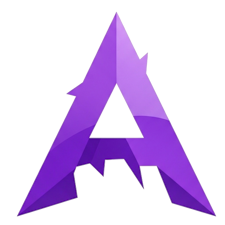

<!-- 
================================================================================================================================================================
                                                             BEM-VINDO AO ECOSSISTEMA VYTRUVE
================================================================================================================================================================
-->
<!-- Bloco da Logo com Fundo Animado -->

  

  <h1 align="center">
    <!-- A CORREÇÃO ESTÁ NA URL ABAIXO -->
    
  </h1>
  

    <strong>Moldando o futuro com código, criatividade e inteligência.</strong>
  

  

<!-- 
================================================================================================================================================================
                                                                      SOBRE NÓS
================================================================================================================================================================
-->

  <h2>🔮 Sobre Nós</h2>
  

    A <strong>Vytruve</strong> é um coletivo de engenheiros e inovadores dedicados a transformar desafios complexos em soluções tecnológicas de ponta. Atuamos na vanguarda da engenharia de software, inteligência artificial e sistemas embarcados, criando produtos que redefinem indústrias e capacitam pessoas.
  

  

    Nossa missão é ir além do convencional, desenvolvendo soluções que não apenas resolvem problemas, mas também inspiram o futuro.
  

  <blockquote>
    <i>"Inovação como princípio, excelência como resultado."</i>
  </blockquote>

  

<!-- 
================================================================================================================================================================
                                                                  NOSSAS DIVISÕES
================================================================================================================================================================
-->

  <h2>🚀 Nossas Divisões de Inovação</h2>
  
Conheça os pilares que sustentam nossa tecnologia e impulsionam o progresso.

<table width="100%" align="center" style="border: none;">
  <tr align="center" style="border: none;">
    <!-- TruveSoftware -->
    <td width="33%" style="padding: 15px; border: none; vertical-align: top;">
      

        
        <h3 style="color: #58A6FF; margin-bottom: 10px;">TruveSoftware</h3>
        
Desenvolvemos sistemas corporativos (ERP, RH) e plataformas web robustas, seguras e escaláveis.

        

          
          
        

      

    </td>
    <!-- vyAi -->
    <td width="33%" style="padding: 15px; border: none; vertical-align: top;">
      

        
        <h3 style="color: #f2994a; margin-bottom: 10px;">vyAi</h3>
        
Criamos o futuro da tecnologia assistiva e da automação com IA, visão computacional e LLMs.

        

          
          
        

      

    </td>
    <!-- Vyst -->
    <td width="33%" style="padding: 15px; border: none; vertical-align: top;">
      

        
        <h3 style="color: #bb6bd9; margin-bottom: 10px;">Vyst</h3>
        
A base de tudo. Projetamos a arquitetura de sistemas, infraestrutura e tecnologia embarcada.

        

          
          
        

      

    </td>
  </tr>
</table>

  

<!-- 
================================================================================================================================================================
                                                                    NOSSA EQUIPE
================================================================================================================================================================
-->

  <h2>👥 Os Arquitetos da Inovação</h2>
  
Uma equipe multidisciplinar unida pela paixão por criar o impossível: Engenheiros de Software, IA, Segurança, APIs, Servidores e Front-end.

  
  <table align="center" style="border: none; margin-left: auto; margin-right: auto; max-width: 900px;">
    <!-- PRIMEIRA LINHA DE MEMBROS -->
    <tr style="border: none;">
      <!-- Pedro H. Garcia -->
      <td style="padding: 15px; border: none; text-align: center; vertical-align: top;">
        
         
        <b>Pedro H. Garcia</b>
         
        <small>Founder, Lead AI & Software Engineer</small>
        

          
          
        

      </td>
      <!-- Vitor Hugo Lemos -->
      <td style="padding: 15px; border: none; text-align: center; vertical-align: top;">
        
         
        <b>Vitor Hugo Lemos</b>
         
        <small>Software Architect</small>
        

          
        

      </td>
      <!-- Antonio Meloni -->
      <td style="padding: 15px; border: none; text-align: center; vertical-align: top;">
        
         
        <b>Antonio Meloni</b>
         
        <small>Software Developer</small>
        

          
          
        

      </td>
      <!-- Pedro Borges -->
      <td style="padding: 15px; border: none; text-align: center; vertical-align: top;">
        
         
        <b>Pedro F. Borges</b>
         
        <small>Software Developer</small>
        

          
          
        

      </td>
    </tr>
    <!-- SEGUNDA LINHA DE MEMBROS -->
    <tr style="border: none;">
      <!-- Kauã Fernando -->
      <td style="padding: 15px; border: none; text-align: center; vertical-align: top;">
        
         
        <b>Kauã Fernando</b>
         
        <small>Embedded Systems Specialist</small>
        

          
          
        

      </td>
      <!-- Ryan Silva -->
      <td style="padding: 15px; border: none; text-align: center; vertical-align: top;">
        
         
        <b>Ryan Silva</b>
         
        <small>Software Engineer</small>
        

          
          
        

      </td>
      <!-- João P. Marim -->
      <td style="padding: 15px; border: none; text-align: center; vertical-align: top;">
        
         
        <b>João P. Marim</b>
         
        <small>Software Developer</small>
        

          
          
        

      </td>
    </tr>
  </table>

   

  

  

<!-- 
================================================================================================================================================================
                                                                    ATIVIDADE DA ORGANIZAÇÃO
================================================================================================================================================================
-->

  <h2>📈 Atividade da Organização</h2>
  
Nossas contribuições e projetos mais recentes. Estamos sempre construindo!

<!-- activity:start -->
<!-- A mágica da GitHub Action acontecerá aqui! -->
<!-- activity:end -->

  

<!-- 
================================================================================================================================================================
                                                                ARSENAL TECNOLÓGICO
================================================================================================================================================================
-->

  <h2>🛠️ Nosso Arsenal Tecnológico</h2>
  
Utilizamos as ferramentas mais modernas e eficientes para construir o futuro.

  

    
  

  

<!-- 
================================================================================================================================================================
                                                                    APOIE NOSSA MISSÃO
================================================================================================================================================================
-->

  <h2>❤️ Apoie Nossa Missão</h2>

  <h3 style="color: #FFFFFF; margin-top: 0;">Gostou do nosso trabalho?</h3>
  

    Sua ajuda nos permite continuar inovando, desenvolvendo projetos open-source e criando tecnologias que fazem a diferença. Considere se tornar um apoiador!
  

  

  

<!-- 
================================================================================================================================================================
                                                                    VAMOS CONECTAR
================================================================================================================================================================
-->

  <h2>📬 Vamos Conectar</h2>
  
Pronto para transformar sua ideia em realidade? Fale conosco.

  

    
     
    
  

